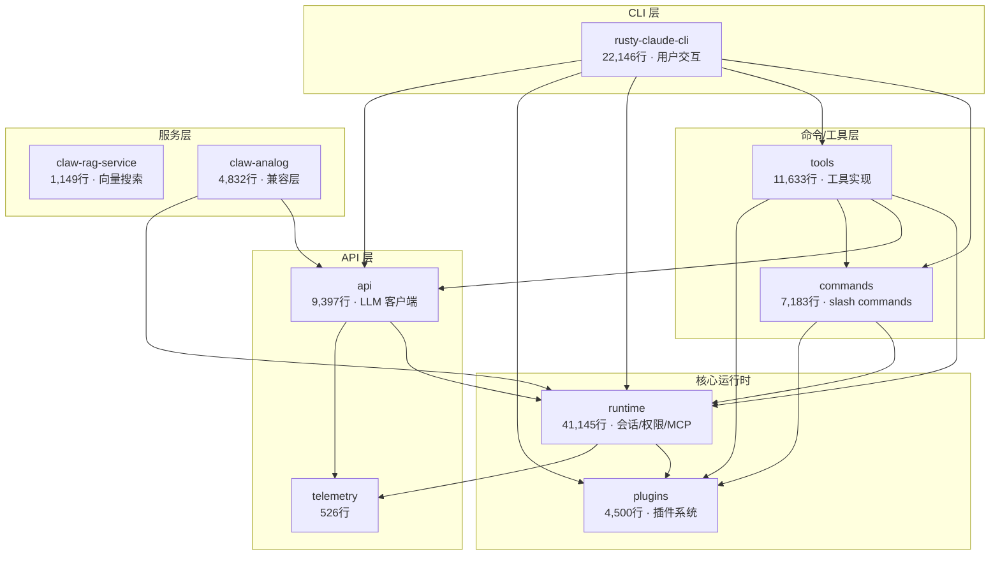
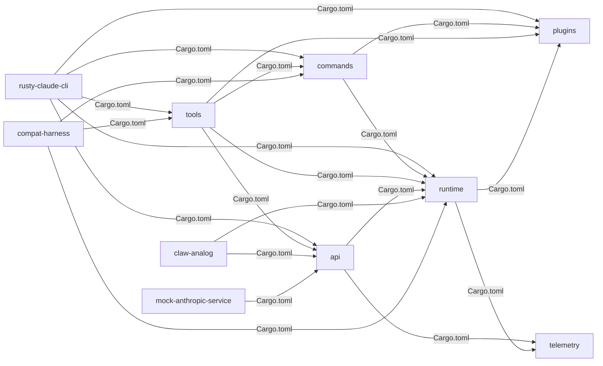
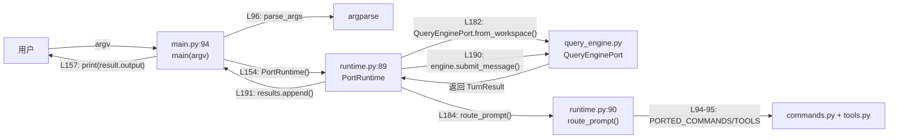
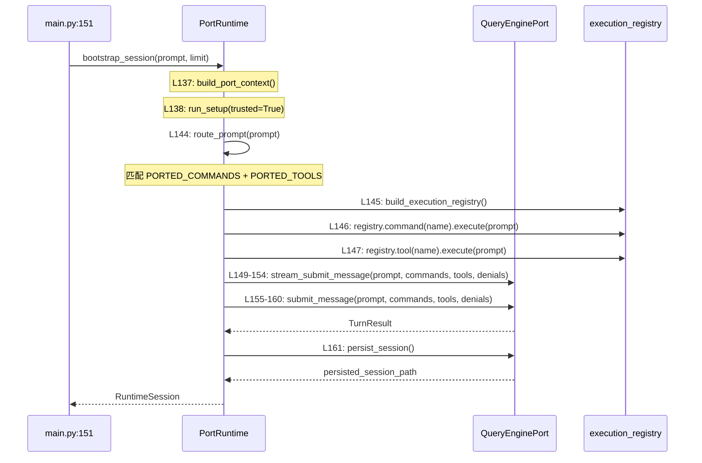

# 架构图集：Claw Code

> 生成时间：2026-06-16 | 代码版本：`d229a9b` | 分析工具：code-to-req v2
> 反幻觉：所有连线标注 Cargo.toml 或代码行号

---

## 1. 系统层级图

**层级判断依据**：
- CLI 层：rusty-claude-cli/Cargo.toml 依赖 5 个内部 crate（最多）
- 命令/工具层：commands + tools 依赖 runtime + plugins
- 核心运行时：runtime 依赖 plugins + telemetry
- API 层：api 依赖 runtime + telemetry
- 无前端框架、无传统数据库（Qdrant 在 RAG 服务中）

---

## 2. 模块依赖图（Rust Crate 间）

**数据来源**：每个 crate 的 `Cargo.toml` 中 `path = "../xxx"` 依赖声明。

---

## 3. 数据流图（Python 移植层）

**场景：用户执行 `claw turn-loop "write tests"` 的调用链（基于 main.py + runtime.py 实际代码）**

**验证证据**：
- `main.py:154` → `results = PortRuntime().run_turn_loop(args.prompt, ...)`
- `runtime.py:182` → `engine = QueryEnginePort.from_workspace()`
- `runtime.py:184` → `matches = self.route_prompt(prompt, limit=limit)`
- `runtime.py:190` → `result = engine.submit_message(turn_prompt, command_names, tool_names, ())`

---

## 4. API 调用时序图

**场景：`PortRuntime.bootstrap_session()` 的内部执行链（基于 runtime.py 实际代码）**

**验证证据**：所有行号来自 `src/runtime.py` 实际代码（136-179行）。

---

## 5. ER 图

> **跳过**：项目无传统数据库 migration/schema 文件。claw-rag-service 使用 Qdrant 向量数据库（通过 API 交互，无 SQL schema 文件）。
> `find . -path "*/migration*" -name "*.sql" -o -path "*/schema*" -name "*.sql"` 返回空。

---

## 图表阅读指南

| 图表 | 看什么 | 回答什么问题 |
|------|--------|------------|
| 系统层级图 | 分层 | Claw Code 整体架构怎么分层？ |
| 模块依赖图 | crate 关系 | 改一个 crate 会影响哪些下游？ |
| 数据流图 | 请求路径 | 用户输入从 CLI 到 AI 响应怎么走？ |
| 时序图 | bootstrap | 一次会话启动涉及哪些步骤？ |
| ER 图 | - | 无传统数据库，已跳过 |
