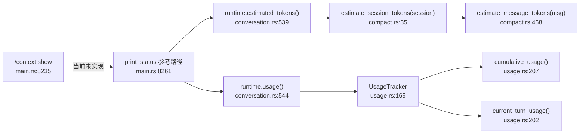

# US-3 Token 估算 — 实现细节

> 生成时间：2026-06-16 | 代码版本：`d229a9b` | 基于 feature doc 中的 US-3
> 验证状态：已通过（全部行号经 sed -n 批量确认）

## 需求描述

作为开发者，我想知道上下文占用了多少 token，以便判断是否需要 compact 或清理。

## 调用链路图



## 关键函数清单

| # | 函数签名 | 文件:行号 | 职责 | 输入 | 输出 |
|---|---------|----------|------|------|------|
| 1 | `pub fn estimated_tokens(&self) -> usize` | `conversation.rs:539` | 对外暴露的 token 估算入口 | &self (BuiltRuntime) | usize |
| 2 | `pub fn estimate_session_tokens(session: &Session) -> usize` | `compact.rs:35` | 遍历所有消息累加 token 估算 | &Session | usize |
| 3 | `fn estimate_message_tokens(message: &ConversationMessage) -> usize` | `compact.rs:458` | 单条消息的 token 粗估（字节/4） | &ConversationMessage | usize |
| 4 | `pub fn usage(&self) -> &UsageTracker` | `conversation.rs:544` | 获取精确 token 追踪器 | &self | &UsageTracker |
| 5 | `pub fn cumulative_usage(&self) -> TokenUsage` | `usage.rs:207` | 累计精确 token 用量 | &self | TokenUsage |
| 6 | `pub fn current_turn_usage(&self) -> TokenUsage` | `usage.rs:202` | 最近一轮的精确 token 用量 | &self | TokenUsage |

## 核心逻辑（代码片段）

**粗估路径**（基于字符数，无需 API 返回）：
```rust
// compact.rs:458-473
fn estimate_message_tokens(message: &ConversationMessage) -> usize {
    message.blocks.iter().map(|block| match block {
        ContentBlock::Text { text } => text.len() / 4 + 1,
        ContentBlock::ToolUse { name, input, .. } => (name.len() + input.len()) / 4 + 1,
        ContentBlock::ToolResult { tool_name, output, .. } => (tool_name.len() + output.len()) / 4 + 1,
        ContentBlock::Thinking { thinking, signature } => 
            thinking.len() / 4 + signature.as_ref().map_or(0, |v| v.len() / 4 + 1),
    }).sum()
}
```

**精确路径**（来自 API 响应的实际 token 计数）：
```rust
// usage.rs:192-198
pub fn record(&mut self, usage: TokenUsage) {
    self.latest_turn = usage;
    self.cumulative.input_tokens += usage.input_tokens;
    self.cumulative.output_tokens += usage.output_tokens;
    self.cumulative.cache_creation_input_tokens += usage.cache_creation_input_tokens;
    self.cumulative.cache_read_input_tokens += usage.cache_read_input_tokens;
    self.turns += 1;
}
```

**现有展示参考**（`/status` 命令已展示 token 信息）：
```rust
// main.rs:8261-8273 (print_status)
fn print_status(&self) {
    let cumulative = self.runtime.usage().cumulative_usage();
    let latest = self.runtime.usage().current_turn_usage();
    // ... 构建 StatusUsage 传入 format_status_report
    estimated_tokens: self.runtime.estimated_tokens(),
}
```

## 两套 Token 数据源对比

| 维度 | 粗估 (estimate_session_tokens) | 精确 (UsageTracker) |
|------|------|------|
| 数据来源 | 本地计算（字节数 / 4） | API 响应的 usage 字段 |
| 可用时机 | 任何时候（无需 API 调用） | 仅在 API 调用后有值 |
| 准确度 | ±30%（不计 tokenizer 差异） | 100% 精确 |
| 包含内容 | 所有消息的文本体积 | input + output + cache |
| 适用场景 | 预判是否接近 context window | 精确费用计算 |

## 分支与边界

| 条件 | 文件:行号 | 处理 |
|------|----------|------|
| `/context` 命令到达 handle_repl_command | main.rs:8235 | 当前走 "not yet implemented" 分支 |
| should_compact 判断是否超阈值 | compact.rs:41 | `估算 token >= max_estimated_tokens` 时返回 true |
| 消息为空（无 blocks） | compact.rs:458 | 返回 0（iter().sum() 对空迭代器） |

## 错误处理

| 错误场景 | 触发条件 | 错误类型 | 用户可见信息 |
|---------|---------|---------|------------|
| /context 当前未实现 | 用户输入 /context | 无错误类型 | "{cmd_name} is not yet implemented in this build." |

（token 估算本身是纯计算，不会产生错误）

## 关联测试

| 测试函数 | 文件:行号 | 覆盖场景 |
|---------|----------|---------|
| `tracks_true_cumulative_usage` | usage.rs:223 | UsageTracker 累计计算正确性 |
| (compact.rs 测试) | compact.rs 内多个测试 | should_compact 阈值判断 |
| format_status_report 相关 | main.rs:14408 | estimated_tokens 输出格式含 "Input estimate ~182000 tokens" |

## 改造评估（实现 US-3：token 信息展示）

### 方案 A：复用 /status 的 token 展示逻辑（最小改动）

- **改动点**：
  1. `main.rs:8235` — 把 `SlashCommand::Context { .. }` 从 "not implemented" 分支拆出来
  2. `main.rs` 新增 ~30 行 — `handle_context_command(action)` 函数，action="show" 时输出 token 信息

- **插入点**：`main.rs:8064` handle_repl_command 中，在 `SlashCommand::Status` 分支附近新增 `SlashCommand::Context { action }` 匹配臂

- **数据获取**（已有，直接调用）：
  - 粗估：`self.runtime.estimated_tokens()` → 一行调用
  - 精确：`self.runtime.usage().cumulative_usage()` → 已有
  - 消息数：`self.runtime.session().messages.len()` → 已有

- **输出格式建议**（参考 print_status 风格）：
  ```
  Context
    Estimated tokens ~{N} (heuristic)
    Actual input     {input_tokens}
    Actual output    {output_tokens}
    Cache (create)   {cache_creation}
    Cache (read)     {cache_read}
    Messages         {count}
  ```

- **影响范围**：仅 main.rs 一个文件，无需改 runtime crate
- **需同步修改的测试**：新增 1 个测试（context show 输出包含 token 信息）
- **预估工作量**：~40 行新增代码 + ~20 行测试

### 方案 B：带开关的持续追踪（需求原文"打开后每次任务结束自动输出"）

- **额外改动**：
  1. `LiveCli` struct（main.rs:7135）加字段 `token_tracking: bool`
  2. `run_turn`（main.rs:7751）结束处（~7782 行，`persist_session` 之前）插入 token diff 输出
  3. `/context track` 子命令：开关 `self.token_tracking`

- **插入点**：main.rs:7782（`self.persist_session()?` 之前），插入：
  ```rust
  if self.token_tracking {
      let usage = self.runtime.usage().current_turn_usage();
      println!("  [token] input={} output={} total={}",
          usage.input_tokens, usage.output_tokens, usage.total_tokens());
  }
  ```

- **影响范围**：main.rs（LiveCli struct + run_turn + handle_repl_command）
- **需同步修改的测试**：新增 2 个测试（开关切换 + turn 后输出）
- **预估工作量**：~80 行新增代码 + ~40 行测试
