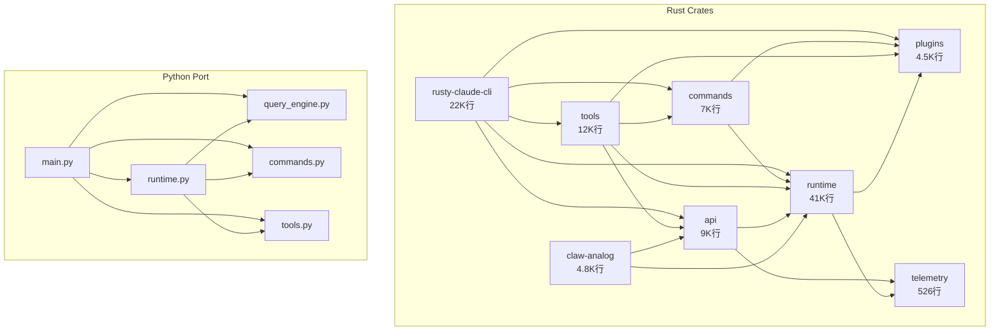

# 知识图谱：Claw Code

> 生成时间：2026-06-16 | 代码版本：`d229a9b` | 分析工具：code-to-req v2
> 实体数：21 | 关系数：22 | 置信度：Rust 关系来自 Cargo.toml，Python 关系来自 import 行号

---

## 实体清单

### Rust Crates

| ID | 类型 | 名称 | 行数 | 描述 |
|----|------|------|------|------|
| r01 | crate | rusty-claude-cli | 22,146 | CLI 前端入口 |
| r02 | crate | runtime | 41,145 | 核心运行时 |
| r03 | crate | api | 9,397 | LLM API 客户端 |
| r04 | crate | commands | 7,183 | slash command 处理 |
| r05 | crate | tools | 11,633 | 工具实现 |
| r06 | crate | plugins | 4,500 | 插件系统 |
| r07 | crate | telemetry | 526 | 遥测 |
| r08 | crate | claw-analog | 4,832 | 兼容层 |
| r09 | crate | claw-rag-service | 1,149 | RAG 向量搜索 |
| r10 | crate | mock-anthropic-service | 1,157 | 测试 mock |
| r11 | crate | compat-harness | 363 | 兼容性测试 |

### Python 核心模块

| ID | 类型 | 名称 | 描述 |
|----|------|------|------|
| p01 | module | main.py | CLI 入口 + argparse 路由 |
| p02 | module | runtime.py | PortRuntime 类 |
| p03 | module | query_engine.py | QueryEnginePort 查询引擎 |
| p04 | module | commands.py | PORTED_COMMANDS 注册 |
| p05 | module | tools.py | PORTED_TOOLS 注册 |
| p06 | module | models.py | 数据类定义 |
| p07 | module | session_store.py | 会话持久化 |
| p08 | module | permissions.py | 工具权限 |
| p09 | module | execution_registry.py | 命令/工具执行器 |
| p10 | module | setup.py | 启动初始化 |

---

## 关系清单

### Rust Crate 依赖（来自 Cargo.toml path 声明）

| 源 | 关系类型 | 目标 | 证据 |
|----|---------|------|------|
| r01 | depends_on | r03 | rusty-claude-cli/Cargo.toml: `api = { path = "../api" }` |
| r01 | depends_on | r04 | rusty-claude-cli/Cargo.toml: `commands = { path = "../commands" }` |
| r01 | depends_on | r02 | rusty-claude-cli/Cargo.toml: `runtime = { path = "../runtime" }` |
| r01 | depends_on | r06 | rusty-claude-cli/Cargo.toml: `plugins = { path = "../plugins" }` |
| r01 | depends_on | r05 | rusty-claude-cli/Cargo.toml: `tools = { path = "../tools" }` |
| r04 | depends_on | r06 | commands/Cargo.toml: `plugins = { path = "../plugins" }` |
| r04 | depends_on | r02 | commands/Cargo.toml: `runtime = { path = "../runtime" }` |
| r05 | depends_on | r03 | tools/Cargo.toml: `api = { path = "../api" }` |
| r05 | depends_on | r04 | tools/Cargo.toml: `commands = { path = "../commands" }` |
| r05 | depends_on | r06 | tools/Cargo.toml: `plugins = { path = "../plugins" }` |
| r05 | depends_on | r02 | tools/Cargo.toml: `runtime = { path = "../runtime" }` |
| r03 | depends_on | r02 | api/Cargo.toml: `runtime = { path = "../runtime" }` |
| r03 | depends_on | r07 | api/Cargo.toml: `telemetry = { path = "../telemetry" }` |
| r02 | depends_on | r06 | runtime/Cargo.toml: `plugins = { path = "../plugins" }` |
| r02 | depends_on | r07 | runtime/Cargo.toml: `telemetry = { path = "../telemetry" }` |
| r08 | depends_on | r03 | claw-analog/Cargo.toml: `api = { path = "../api" }` |
| r08 | depends_on | r02 | claw-analog/Cargo.toml: `runtime = { path = "../runtime" }` |
| r11 | depends_on | r04 | compat-harness/Cargo.toml: `commands = { path = "../commands" }` |
| r11 | depends_on | r05 | compat-harness/Cargo.toml: `tools = { path = "../tools" }` |
| r11 | depends_on | r02 | compat-harness/Cargo.toml: `runtime = { path = "../runtime" }` |
| r10 | depends_on | r03 | mock-anthropic-service/Cargo.toml: `api = { path = "../api" }` |

### Python 模块依赖（来自 import 行号）

| 源 | 关系类型 | 目标 | 证据 |
|----|---------|------|------|
| p01 | depends_on | p02 | main.py:14 `from .runtime import PortRuntime` |
| p01 | depends_on | p03 | main.py:12 `from .query_engine import QueryEnginePort` |
| p01 | depends_on | p04 | main.py:7 `from .commands import ...` |
| p01 | depends_on | p05 | main.py:18 `from .tools import ...` |
| p01 | depends_on | p08 | main.py:10 `from .permissions import ToolPermissionContext` |
| p01 | depends_on | p07 | main.py:15 `from .session_store import load_session` |
| p01 | depends_on | p10 | main.py:16 `from .setup import run_setup` |
| p02 | depends_on | p04 | runtime.py:5 `from .commands import PORTED_COMMANDS, get_command` |
| p02 | depends_on | p03 | runtime.py:9 `from .query_engine import ...` |
| p02 | depends_on | p06 | runtime.py:8 `from .models import ...` |
| p02 | depends_on | p05 | runtime.py:12 `from .tools import PORTED_TOOLS` |
| p02 | depends_on | p09 | runtime.py:13 `from .execution_registry import build_execution_registry` |
| p02 | depends_on | p10 | runtime.py:10 `from .setup import ...` |
| p03 | depends_on | p04 | query_engine.py:7 `from .commands import build_command_backlog` |
| p03 | depends_on | p06 | query_engine.py:8 `from .models import ...` |
| p03 | depends_on | p05 | query_engine.py:11 `from .tools import build_tool_backlog` |
| p03 | depends_on | p07 | query_engine.py:10 `from .session_store import ...` |
| p09 | depends_on | p04 | execution_registry.py:5 `from .commands import ...` |
| p09 | depends_on | p05 | execution_registry.py:6 `from .tools import ...` |
| p05 | depends_on | p06 | tools.py:8 `from .models import ...` |
| p05 | depends_on | p08 | tools.py:9 `from .permissions import ToolPermissionContext` |
| p04 | depends_on | p06 | commands.py:8 `from .models import ...` |

### 跨层调用关系（来自代码验证）

| 源 | 关系类型 | 目标 | 证据 |
|----|---------|------|------|
| p01 | calls | p02 | main.py:154 `PortRuntime().run_turn_loop(...)` |
| p02 | calls | p03 | runtime.py:182 `QueryEnginePort.from_workspace()` |
| p02 | calls | p09 | runtime.py:145 `build_execution_registry()` |
| r01 | calls | r03 | main.rs:37-43 `use api::{AnthropicClient, ...}` |
| r01 | calls | r04 | main.rs:45-52 `use commands::{...}` |
| r01 | calls | r06 | main.rs:54 `use plugins::{PluginHooks, ...}` |
| r01 | calls | r02 | main.rs:56-60 `use runtime::{...}` |

---

## Mermaid 可视化



---

## JSON 数据

```json
{
  "metadata": {
    "project": "Claw Code",
    "generated_at": "2026-06-16",
    "commit": "d229a9b",
    "total_nodes": 21,
    "total_edges_rust": 21,
    "total_edges_python": 22,
    "confidence": "Rust: Cargo.toml path deps; Python: import line numbers"
  }
}
```

---

## 图谱解读

**核心节点**（入度最高）：
1. **runtime (r02)** — 被 7 个 crate 依赖，是全项目的基础设施层
2. **plugins (r06)** — 被 5 个 crate 依赖，插件系统是横切关注点
3. **api (r03)** — 被 4 个 crate 依赖，所有 LLM 交互通过此层

**架构特点**：
- 洋葱模型：CLI → commands/tools → runtime → plugins/telemetry
- Python 层是 Rust 的"镜像移植"（README 描述的 "porting workspace"），不是独立应用
- runtime crate 41K 行是最大单元，内部有 40+ 个 mod（可能需要进一步拆分）
