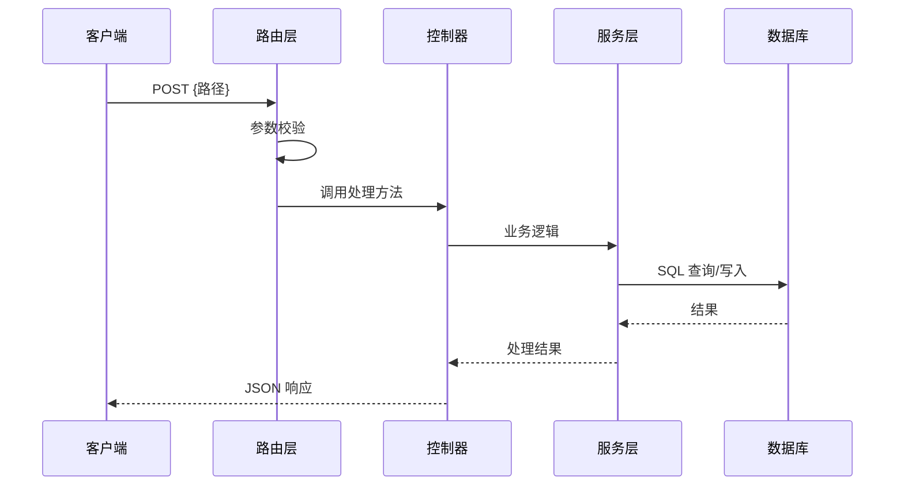

# 架构图集：{项目名}

> 生成时间：{时间} | 代码版本：`{git commit hash}` | 分析工具：code-to-req v2
> 图表格式：Mermaid（可在 GitHub / VS Code / Typora 直接渲染）

---

## 1. 系统层级图

展示系统的分层结构和外部依赖关系。

```mermaid
graph TB
    subgraph 客户端
        Browser[浏览器]
    end

    subgraph 应用层
        Frontend[前端应用<br/>{框架}]
        Backend[后端服务<br/>{框架}]
    end

    subgraph 数据层
        DB[(数据库<br/>{类型})]
        Cache[(缓存<br/>{类型})]
        Storage[(文件存储<br/>{类型})]
    end

    subgraph 外部服务
        ExtAPI[外部 API<br/>{服务名}]
    end

    Browser --> Frontend
    Frontend --> Backend
    Backend --> DB
    Backend --> Cache
    Backend --> Storage
    Backend --> ExtAPI
```

---

## 2. 模块依赖图

展示项目内部核心模块之间的依赖关系。

> 归并规则：同目录下的文件归并为一个模块节点，只展示模块间关系。

```mermaid
graph LR
    {模块A}[模块A<br/>N个文件] --> {模块B}[模块B<br/>N个文件]
    {模块A} --> {模块C}[模块C<br/>N个文件]
    {模块B} --> {模块D}[模块D<br/>N个文件]
```

**依赖方向说明**：箭头表示"依赖"关系（A → B 表示 A 的代码 import 了 B）

---

## 3. 数据流图

展示一个典型核心业务请求的完整数据路径。

> 选取标准：API 端点最多 或 业务最核心的模块

**场景：{业务场景名，如"创建需求"}**

```mermaid
flowchart LR
    Client[客户端] -->|HTTP POST| Router[路由层<br/>{文件名}]
    Router -->|参数校验| Controller[控制器<br/>{文件名}]
    Controller -->|业务调用| Service[服务层<br/>{文件名}]
    Service -->|查询/写入| DB[(数据库<br/>{表名})]
    Service -->|可选| Cache[(缓存)]
    Service -->|可选| ExtAPI[外部服务]
    Controller -->|响应| Client
```

---

## 4. API 调用时序图

展示一个典型写操作的完整调用链路。

**场景：{操作名，如"用户登录"}**



---

## 5. ER 图（数据模型关系）

展示核心数据表之间的实体关系。

> 规则：≤10 张表全画；>10 张只画有外键关系的核心表

```mermaid
erDiagram
    {表A} ||--o{ {表B} : "has many"
    {表A} ||--|| {表C} : "has one"
    {表B} }o--|| {表D} : "belongs to"

    {表A} {
        uuid id PK
        string name
        timestamp created_at
    }
    {表B} {
        uuid id PK
        uuid {表A}_id FK
        string title
    }
```

**未画出的表**（无直接外键关系）：
- {表名} — {一句话描述}
- ...

---

## 图表阅读指南

| 图表 | 适合谁看 | 回答什么问题 |
|------|---------|------------|
| 系统层级图 | 所有人 | "系统有几层？依赖什么外部服务？" |
| 模块依赖图 | 架构师/开发 | "改一个模块会影响哪些模块？" |
| 数据流图 | 架构师/开发 | "一个请求从头到尾怎么走？" |
| API 时序图 | 开发/测试 | "接口调用的具体步骤是什么？" |
| ER 图 | 开发/DBA | "数据之间什么关系？" |
